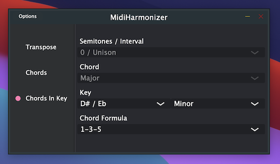

# MidiHarmonizer

This plugin reads midi data and outputs additional midi notes based on the user selection. If the input midi is not a note on/off the plugin passes the data through without altering it. The plugin offers 3 modes of operation:

### Transpose
Transpose the input midi by a number of selected semitones.

### Chords
Build chords on top of the input midi, treating the input midi as the root note. If multiple notes are played the plugin will generate multiple chords based on the root notes. The chord type can be selected on the right panel.

### Chords in key
Similar to chords mode but now the user has a choice of key. if any notes are played off key the plugin will perform pitch correction. In this mode the chord is dependent on the chord formula, the software will determine the charecteristic (major, minor, diminished etc.) of the chord based on the relation of the root note to the key selected.
